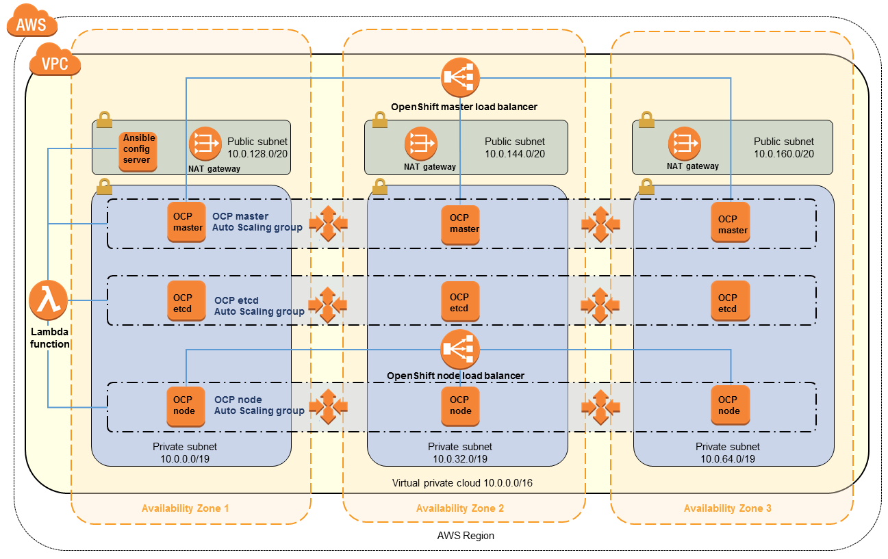

# openshift-terraform

## **WORK IN PROGRESS**

This demo Terraform package will build an entire OpenShift environment in AWS.
Mostly for my own practice with Terraform and proof-of-concept. I plan to use
Terraform modules and abstract as much as I can. Ultimate goal would be for
this package to be usable on other cloud platforms with little change.

### Features complete
- VPC creation
- Internet gateway
- Subnets
- Routes
- Security groups
- EC2 roles and policies
- AMIs (CentOS 7)
- Bastion EC2 instance

### Expected features
- DNS zone creation
  - Public and private zones
- Let's Encrypt certificate integration
- New VPC for all objects
  - Three private and three public subnets, each type in three different
    Availability Zones
  - NAT gateways in each public subnet
- As secure as possible
- A Bastion host acting as the Ansible config server
  - OpenShift to be install via Ansible playbooks
- Elastic Load Balancers for OpenShift masters and nodes
- Auto Scale Groups for OpenShift masters, etcd instances, and nodes
  - Scaling events handeled by CloudWatch/Lambda/Ansible functions
- IPv6

### Ultimate goal

